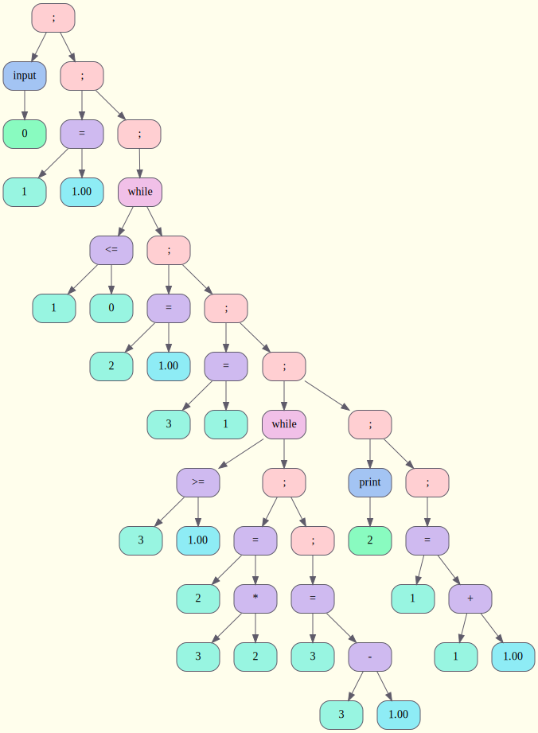

# Language

## Введение

Мой собственный язык программирования по синтаксису похожий на язык C.

## Скачивание и установка проекта

Для установки программы используются утилиты `make` и `git`.

```CMake
    git clone git@github.com:ksshkh/language.git
    make
```

## Принцип работы

Мой проект состоит из двух частей:
1. Frontend
2. Backend

Также в этом проекте был использован мой прошлый проект CPU, в котором и исполняется написанный код.


> [!NOTE]
>
> Программа поддерживает тип данных int

### Frontend

В этой части проекта выполняется лексический разбор кода, его токенизация. Затем с помощью
алгоритма рекурсивного спуска строится дерево исходного кода. Далее вы можете видеть пример программы,
написанной на моём языке (конкретно эта выводит факториалы всех натуральных чисел, меньших или равных введённому пользователем числу; другие программы лежат в папке ```programs```) и её представление в виде дерева:

```
input(num);
i = 1;
while(i <= num) {
    res = 1;
    j = i;
    while(j >= 1) {
        res = j * res;
        j = j - 1;
    }
    print(res);
    i = i + 1;
}
```



Также в фронтенде строится таблица имён переменных и функций.

## Backend

Построенное дерево транслируется в ассемблерный код (речь идёт про написанный мною ранее ассемблер в проекте CPU).
Пример полученного ассемблерного кода:

```
in
pop [0]
push 1
pop [1]
loop1:
push [1]
push [0]
ja label1
push 1
pop [2]
push [1]
pop [3]
loop2:
push [3]
push 1
jb label2
push [3]
push [2]
mul
pop [2]
push [3]
push 1
sub
pop [3]
jmp loop2
label2:
push [2]
out
push [1]
push 1
add
pop [1]
jmp loop1
label1:
```


> [!NOTE]
>
> Пока в проекте реализованы такие конструкции, как while, if/else if/else, некоторые логические операции; функции будут добавлены в скором времени